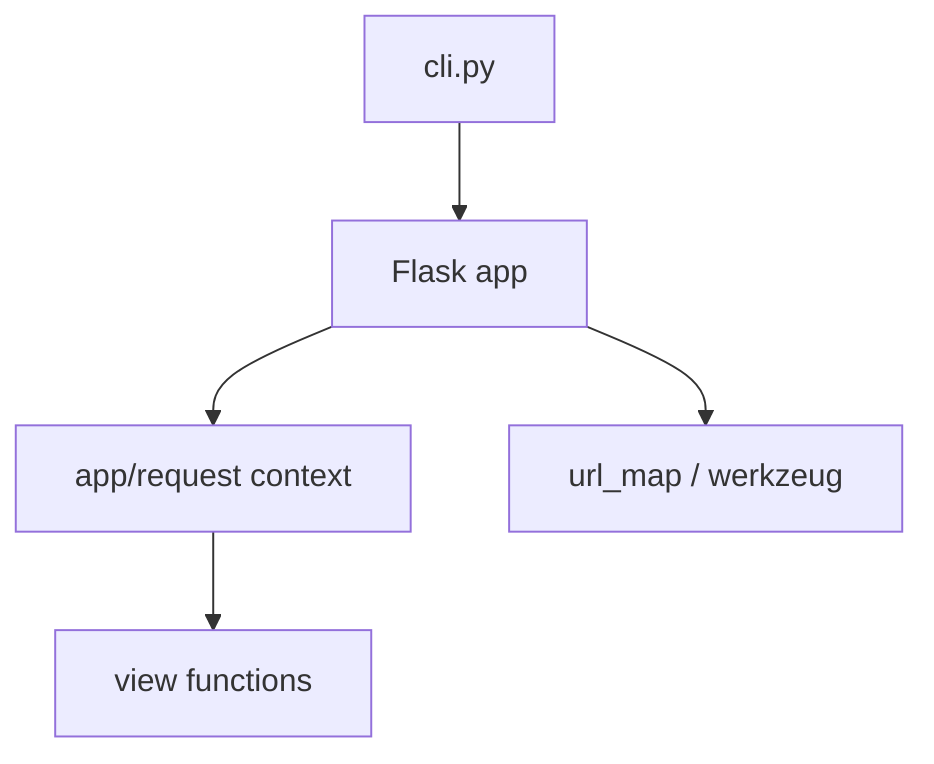

# REPO-MAP.md template

The fixed section order for `.repo-intel/REPO-MAP.md`. Keep the order and the headings — other skills navigate this file by heading, and `repo-lessons` promotes entries into `## Gotchas` by name.

Fill only what is known. An omitted section is better than a padded one; a wrong section is worse than both. Mark anything not directly verified with `(inferred)` or `(unverified)`.

---

```markdown
# <repo name> — repo map

> One-sentence statement of what this repo is and who it is for.

## What this is

One paragraph. What problem it solves, what kind of artifact it produces (library,
CLI, service, monorepo), and the shape of its users. Written for someone who has
never seen the repo and has ninety seconds.

## Fast facts

| | |
|---|---|
| **Primary language** | Python 3.11 (18.4k lines, 83 files) |
| **Also present** | reStructuredText docs, TOML config |
| **Repo size** | 236 tracked files |
| **Entrypoint** | `src/flask/__init__.py`, CLI at `src/flask/cli.py` |
| **Build** | `uv build` — *verified* |
| **Test** | `uv run --group dev tox run` — *verified* (bare `pytest` also works for a single env) |
| **Lint** | `ruff check .` — *verified* |
| **CI** | `.github/workflows/tests.yaml` (tox matrix), `pre-commit.yaml` |
| **History** | 5,556 commits, 2010-04-06 → 2026-08-16 |
| **License** | BSD-3-Clause |

## 60-second orientation

The five to eight most likely tasks, each pointing at where to start. This is the
highest-traffic section in the file — write it last, once the code is understood.

| To change… | Start at | Then look at |
|---|---|---|
| Request routing | `src/flask/app.py:412` | `sansio/scaffold.py` for the decorator |
| CLI behavior | `src/flask/cli.py:190` | tests in `tests/test_cli.py` |

## Architecture

Two or three paragraphs on how the pieces fit — the layering, what depends on what,
where the boundaries are, and which direction data flows across them.

Then a diagram, kept to the real structure rather than an idealized one:



## Module map

| Path | Responsibility | Key files | Depended on by |
|---|---|---|---|
| `src/flask/sansio/` | Framework logic with no I/O | `app.py`, `scaffold.py` | `flask.app` |
| `src/flask/json/` | JSON encoding and the provider hook | `provider.py` | app, views |

Cover every top-level module. For repos over ~2,000 files, cover modules only, and
expand just the ones the survey flags as central by churn and fan-in.

## Primary flows

One to three end-to-end paths, traced with real line references. Choose the paths a
newcomer would actually need: the main request path, the main build step, the core
transform.

**HTTP request → response**
1. `app.py:1498` `wsgi_app()` pushes a request context
2. `app.py:1471` `full_dispatch_request()` runs before-request handlers
3. `app.py:880` `dispatch_request()` resolves the view from `url_map`
4. …

## Key abstractions & invariants

The three to seven concepts that must be understood before changing anything, and
the rules the code assumes but does not enforce.

- **Application context** — must be pushed before `current_app` resolves; a bare
  call outside it raises `RuntimeError` rather than returning `None`.

## Hot spots

Files with high churn, cross-referenced against size and complexity — where change
concentrates, and therefore where risk and review attention concentrate.

| File | Commits | Note |
|---|---|---|
| `src/flask/app.py` | 136 | Largest module and the most-changed; touches routing, context, and dispatch |

## Gotchas

Non-obvious constraints that would otherwise be learned the hard way. Lessons
promoted from `LESSONS.md` land here — see the lessons protocol.

- The root `test` script is a no-op; the real suite runs through tox.

## Open questions

What stayed ambiguous after the survey. These seed `LESSONS.md` and are worth
resolving on the next pass.

- Is `src/flask/sansio/` intended as public API? No `__all__`, no docs entry.

---
<!-- repo-intel provenance -->
- **Generated by:** repo-intel/repo-map v0.1.0
- **Commit:** <head_sha>
- **Generated:** <YYYY-MM-DD HH:MM UTC>
- **Regenerate with:** /repo-intel:repo-map
```

## Section notes

- **Fast facts** — every command carries a `verified` or `unverified` marker. This is the single most-used and most-often-wrong part of the file.
- **60-second orientation** — the section that makes the map worth generating. A map that describes structure without saying where to start is a table of contents, not an orientation.
- **Architecture** — describe the structure that exists, including its inconsistencies. A tidy diagram of a system that is not tidy actively misleads.
- **Primary flows** — real line numbers, or omit the section. Approximate traces are worse than none because they cannot be checked.
- **Open questions** — never leave empty on a first pass. Anything genuinely understood end-to-end on a first read was a trivial repo.
